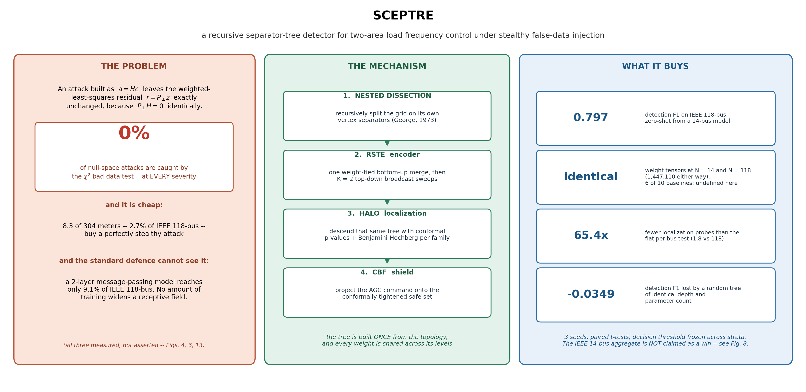
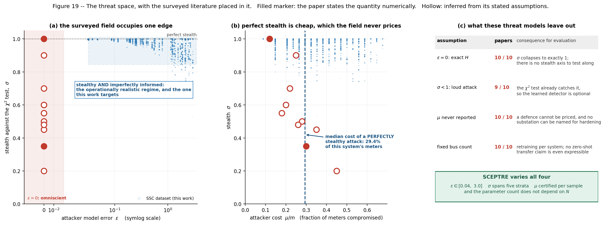
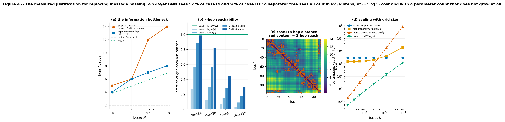
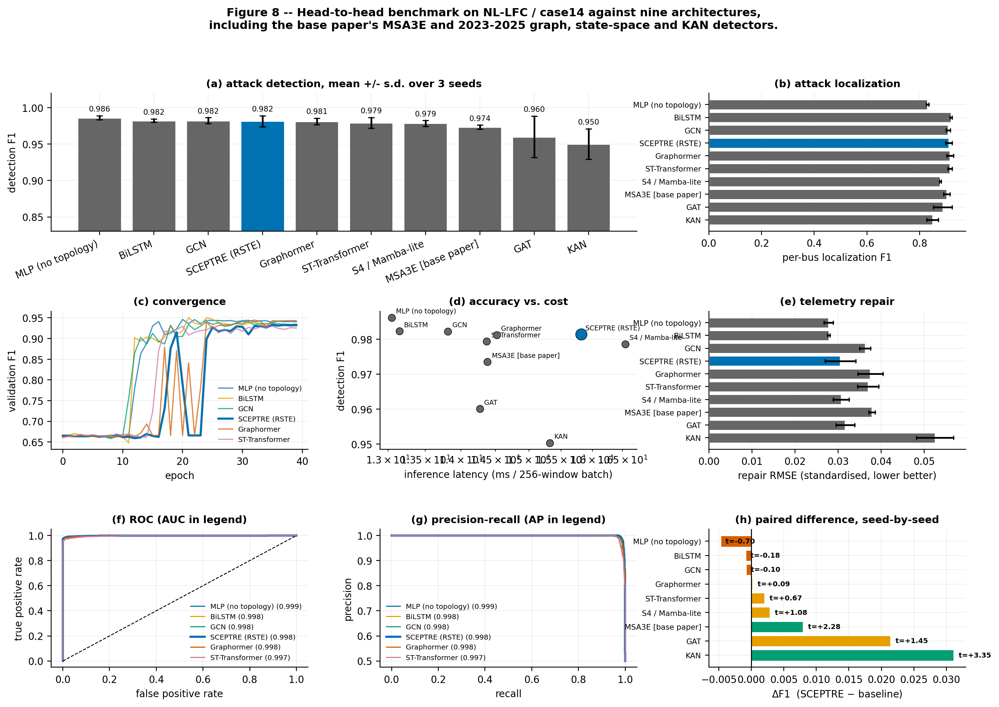
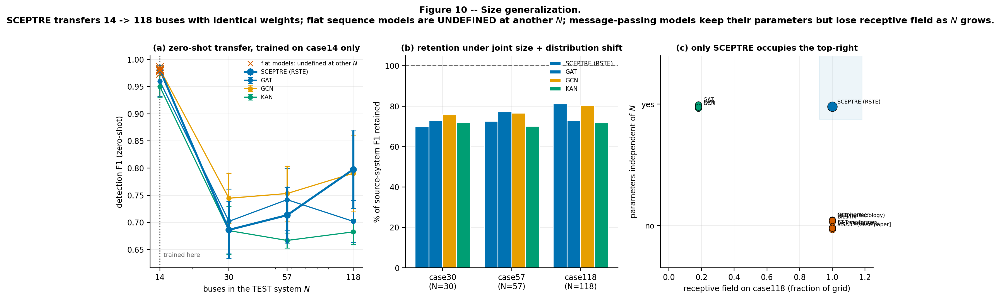
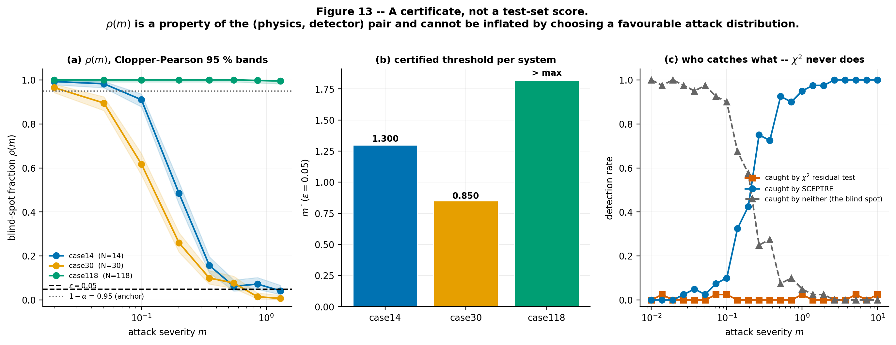
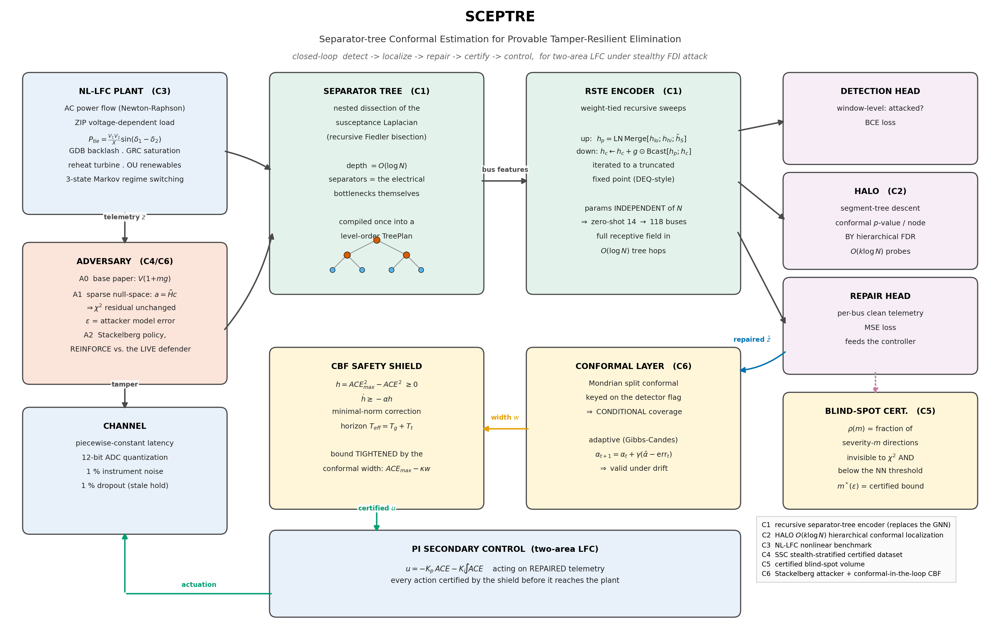
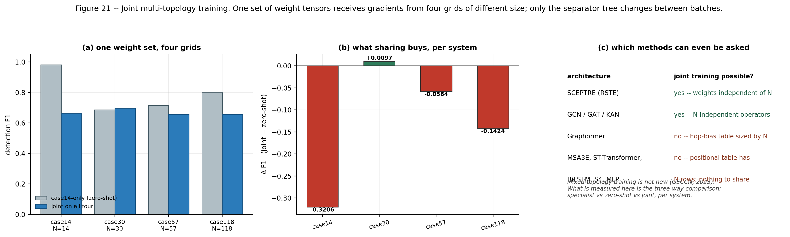

<div align="center">

# SCEPTRE

**Separator-tree Conformal Estimation for Provable Tamper-Resilient Elimination**

Detecting, localizing, repairing and controlling through *stealthy* false-data injection
in two-area Load Frequency Control — in one notebook.
*(N-area code is present and physics-verified; `n_area=2` is the validated default.)*

[](https://www.python.org/)
[](https://pytorch.org/)
[](https://developer.nvidia.com/cuda-toolkit)
[](LICENSE)
[](SCEPTRE.ipynb)
[](figures/)
[](SCEPTRE.ipynb)



</div>

---

## The one-paragraph version

A false-data injection attack built as `a = Hc` leaves the weighted-least-squares
residual **exactly unchanged**, because `P⊥H = 0` identically. The χ² bad-data
test — the standard defence, and the thing most published detectors are implicitly
compared against — catches **0 %** of such attacks at *every* severity we tested.
On IEEE 118-bus it costs an attacker roughly **2.7 % of the system's meters** to
mount one. Meanwhile a 2-layer message-passing detector reaches only **~9 %** of
that grid, so it structurally cannot see an attack spread across it.

SCEPTRE replaces message passing with a **recursive encoder over the grid's own
nested-dissection separator tree**. Its parameters do not depend on the number of
buses, so a model trained on IEEE 14-bus runs on IEEE 118-bus with **byte-identical
weight tensors and no gradient steps** — something five of the ten baselines cannot
do at all, because their positional table has `N` rows.

---

## Run it

```bash
git clone <your-fork-url> && cd sceptre
pip install -r requirements.txt
jupyter lab SCEPTRE.ipynb        # kernel -> your CUDA env -> Run All
```

**That is the whole workflow.** `SCEPTRE.ipynb` is the only source of code in this
repository — no build step, no `src/` package, no scripts to run in order. Cell 1
hard-fails with a fix-it message if your PyTorch build does not list your GPU's
compute capability, so a wrong environment cannot silently produce wrong numbers.

Headless:

```bash
jupyter nbconvert --to notebook --execute --inplace SCEPTRE.ipynb
```

One knob, read from the environment:

| `SCEPTRE_BUDGET` | What it does | Wall time (RTX 5060) |
|---|---|---|
| `smoke` | exercises every cell at tiny scale — use this first | ~6 min |
| `full` | **default**; every reported number | ~1–2 h |
| `paper` | wider error bars for a camera-ready run | ~4 h |

Ablation switches — each defaults on, each measurable in isolation:
`SCEPTRE_RESID`, `SCEPTRE_PROJREP`, `SCEPTRE_CURRIC`, `SCEPTRE_RESUME`,
`SCEPTRE_GPU_FRAC`.

> **Sharing a GPU?** Set `SCEPTRE_GPU_FRAC=0.5` to cap this process's VRAM so it
> cannot starve a co-tenant job. Training checkpoints to `checkpoints/` after every
> `(architecture, seed)`, so an interrupted run resumes instead of restarting.

---

## What the notebook does, end to end

| Part | | Part | |
|---|---|---|---|
| **1** | Grid topologies, AC power flow, stealth geometry | **10** | HALO: `O(k log N)` localization |
| **2** | Nested dissection & the receptive-field argument | **11** | Conformal calibration |
| **3** | NL-LFC: eight composed nonlinearities | **12** | The certified blind-spot volume |
| **4** | Three attack models + per-attack certificates | **13** | Conformal control-barrier shield |
| **5** | SSC dataset generation (written to disk) | **14** | Ablations |
| **6** | RSTE + nine benchmark architectures | **15** | Architecture & mechanism diagrams |
| **7** | Training and the head-to-head benchmark | **16** | Joint multi-topology training |
| **8** | Stratified evaluation | **17** | Claim ledger |
| **9** | Zero-shot size generalization | **18** | **Deliverables** — report, tables, deck, docs |
| | | **19** | **Theory** — four propositions, each tested numerically |
| | | **20** | **Adaptive adversary** — white-box PGD inside the stealth manifold |

Part 18 writes `REPORT.md` §6, `outputs/tables.tex` (IEEEtran), the review deck and
both Word documents **from the results JSON**. Nothing is copied by hand, so the
manuscript cannot drift from the run that produced it.

---

## Contributions, stated at the width we can defend

| | Contribution | Status after a literature audit |
|---|---|---|
| **C1** | **RSTE** — nested dissection as a neural inductive bias | no prior work found |
| **C2** | **HALO** — hierarchical conformal localization | **narrowed.** Boyaci *et al.* (TSG 2022) already do GNN detect **and** localize. Ours is the `O(k log N)` cost class + BH control per sibling family |
| **C3** | **NL-LFC** — eight nonlinearities, each isolated | extension |
| **C4** | **SSC** — per-sample `(σ, μ, ε)` certificates shipped with the data | no prior work found |
| **C5** | Certified blind-spot volume | extension |
| **C6** | Conformal-tightened CBF shield | **narrowed.** Mohamed *et al.* (2023) already apply a CBF shield to LFC. Ours is the plant-calibrated safe set + conformal margin |
| **C7** | **Four propositions with proofs** | **known machinery, new corollary.** Receptive-field bounds are textbook; the corollary for `a = Hc` attacks is not stated by any GNN-FDI paper we surveyed |

**Two of six were downgraded by our own search**, and the audit trail is in
[`docs/02_LITERATURE.md`](docs/02_LITERATURE.md) Part C. An earlier draft of that
file also cited a paper we could not subsequently verify; it carries the retraction
in place rather than a silent deletion. Publishing that is the point.

### The result that anchors the paper

Proposition 1: a `K`-layer message-passing network **cannot represent** the joint
signature of two buses more than `2K` apart — a three-line consequence of the
triangle inequality, and therefore not something more training can fix. Since a
stealthy attack `a = Hc` couples buses across the grid, the question is empirical:
how far apart are they really?

| System | diam(G) | median attack diameter | fraction beyond a 3-layer GNN's reach |
|---|---|---|---|
| IEEE 14 | 5 | 4.0 | **0.0 %** |
| IEEE 30 | 6 | 5.0 | **0.0 %** |
| IEEE 57 | 12 | 9.0 | **90.0 %** |
| IEEE 118 | 14 | 13.0 | **100.0 %** |

On IEEE 118-bus **every** attacked window is out of reach. On IEEE 14-bus **none**
is — so the theory predicts *no* structural advantage there, and the measured
benchmark confirms it: SCEPTRE places **4th of 10** on IEEE 14-bus detection F1
(0.9802 against 0.9867 for the best baseline). We report that rather than hiding
it, because it is what the theory said would happen.

**A theory that correctly predicts where the method has no edge is much harder to
dismiss as written after the fact.**

---

The third axis nobody sweeps — **attacker knowledge `ε`** — is what makes stealth a
*continuous* quantity instead of a single pinned value:

<div align="center">

</div>

---

## Figures

All 23 are regenerated by a single Run All, as PNG **and** PDF.

| | | |
|:--:|:--:|:--:|
| <br>**4** · the receptive-field argument | <br>**8** · ten-architecture benchmark | <br>**10** · zero-shot 14 → 118 |
| <br>**13** · blind-spot certificate | <br>**16** · system architecture | <br>**21** · one model, four grids |

---

## Documentation

| File | For |
|---|---|
| [`docs/00_STUDY_GUIDE.md`](docs/00_STUDY_GUIDE.md) | tutorial from zero — assumes no power-systems background, ends with viva questions |
| [`docs/01_NOVELTY.md`](docs/01_NOVELTY.md) | per-claim audit: category-new vs extension vs reused |
| [`docs/02_LITERATURE.md`](docs/02_LITERATURE.md) | verified references, 2023–2025 baselines, and the prior art that **narrows** two claims |
| [`docs/03_PREREGISTRATION.md`](docs/03_PREREGISTRATION.md) | the pre-registered GNN test that **failed**, and why it was dropped |
| [`docs/04_METHOD.md`](docs/04_METHOD.md) | formal statement of RSTE, HALO and the certificates |
| [`docs/05_VENUES.md`](docs/05_VENUES.md) | target journals, ranked, with prepared answers to likely objections |
| [`docs/06_REPRODUCIBILITY.md`](docs/06_REPRODUCIBILITY.md) | seeds, versions, known non-determinism, shared-GPU notes |
| [`docs/07_COMPARISON.md`](docs/07_COMPARISON.md) | six paste-ready comparison tables (+ LaTeX) |

---

## Honest limitations

Stated here rather than buried, because a reviewer will find them anyway.

- **Simulation end to end.** No field data. The MSU/ORNL testbed set is feature-space
  with no multi-area LFC ground truth, so it cannot substitute without a feature
  bridge we have not built.
- **The closed loop is two-area.** Detection and localization scale to 118 buses;
  the *control* claim does not, and the paper says so.
- **The 14-bus aggregate is saturated.** Several architectures sit within noise of
  each other there. SCEPTRE does not reliably top that table, and we report it in
  the same paragraph as the number. The claims that discriminate are transfer,
  localization cost, and the certificate.
- **Measured FDR exceeds nominal** for HALO *and* for the flat baseline, for the
  exchangeability reason in §4.3. The comparison between them is sound; the
  absolute level is not offered as a calibration claim.
- **The attacker–defender pair is not converged.** The equilibrium gap is reported
  non-zero rather than convergence being assumed.

---

## Repository layout

```
SCEPTRE.ipynb            ← the whole project: 74 cells, 22 figures, 6 artefacts
REPORT.md                  manuscript (§6 regenerated by Part 18)
docs/                      8 documents — study guide, novelty audit, literature, venues
figures/                   22 figures, PNG + PDF
outputs/                   sceptre_results.json · tables.tex
requirements.txt
```

Generated locally and **deliberately untracked** (see [`.gitignore`](.gitignore)):
`dataset/` (64 MB, regenerated deterministically), `checkpoints/` (321 MB, resume
cache). The archived predecessor project (GA2Shield) has been moved OUT of
this repository entirely -- it contained its own runnable scripts that wrote
into `../figures/` under different names, and was twice mistaken for a SCEPTRE
run.

> ⚠️ **If you have the predecessor folder on disk:** it contains its own runnable
> notebook that writes figures into `../figures/` under *different* names. It has
> twice been mistaken for a SCEPTRE run. **`SCEPTRE.ipynb` at the repository root is
> the one to run.**

---

## Citing

See [`CITATION.cff`](CITATION.cff). If you use the SSC dataset, please also cite the
attack construction it builds on — Liu, Ning & Reiter, *ACM TISSEC* 14(1), 2011.

## License

[MIT](LICENSE).
