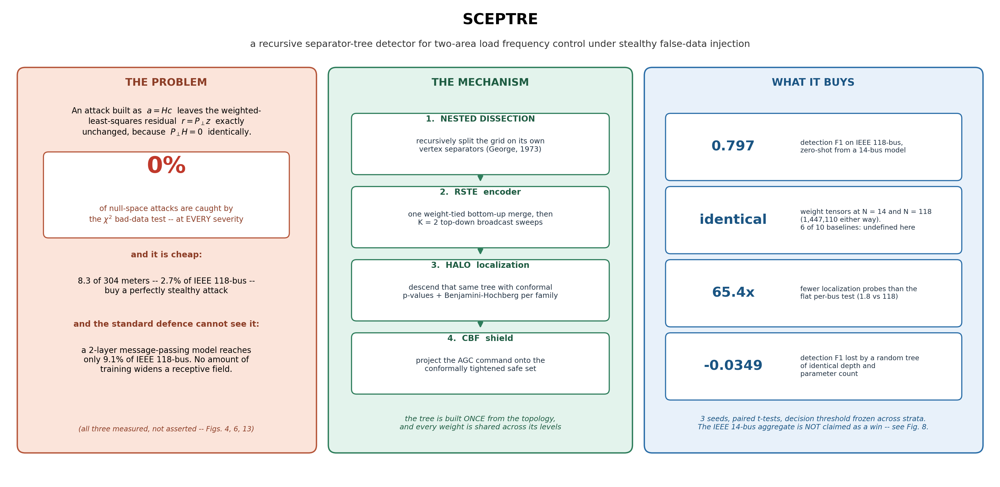

<div align="center">

# SCEPTRE

### Separator-tree Conformal Estimation for Provable Tamper-Resilient Elimination

**A reproducible study of stealthy false-data injection defence for load-frequency control**

[](https://www.python.org/)
[](SCEPTRE.ipynb)
[](figures/)
[](LICENSE)



</div>

---

## What this repository is

SCEPTRE is a single-notebook research project on detecting, localizing, repairing,
and safely responding to **stealthy false-data injection (FDI)** attacks in power
systems. The complete implementation, experiment sequence, figures, and
deliverable generation live in [`SCEPTRE.ipynb`](SCEPTRE.ipynb).

The study challenges the usual benchmark attack model. An attack constructed as
`a = Hc` lies in the state-estimator residual null space, so the classical
χ² bad-data test cannot detect it. SCEPTRE uses the power grid's
nested-dissection separator tree as a learned spatial representation, then reuses
that tree for calibrated hierarchical localization and control-aware uncertainty.

> **Scope:** this is a simulation study. Detection and localization are evaluated
> on IEEE 14-, 30-, 57-, and 118-bus systems; the closed-loop control study uses a
> two-area nonlinear LFC plant.

## Highlights

| Capability | What SCEPTRE provides |
|---|---|
| Threat model | Physics-constrained null-space FDI attacks with per-sample stealth, cost, and model-error certificates |
| Spatial encoder | Recursive Separator-Tree Encoder (RSTE), with weights shared across tree levels and grid sizes |
| Localization | HALO: hierarchical split-conformal testing with `O(k log N)` probes for an attack involving `k` buses |
| Plant | NL-LFC: a nonlinear two-area load-frequency-control benchmark with eight modeled nonlinearities |
| Evaluation | Ten architecture arms, stratified results, zero-shot size transfer, ablations, proposition tests, and an adaptive white-box adversary |
| Reproducibility | One notebook, fixed seed contract, resumable checkpoints, generated figures, JSON results, Markdown report, Word documents, and presentation deck |

## Results at a glance

The checked-in results come from the notebook's `full` budget and are stored in
[`outputs/sceptre_results.json`](outputs/sceptre_results.json). They are useful
for orientation; rerun the notebook to reproduce them on your environment.

| Finding | Current measured evidence |
|---|---|
| Classical residual test | Detects **0%** of the evaluated `a = Hc` attacks, as expected from `P⊥H = 0` |
| Size transfer | RSTE trained on IEEE 14-bus reaches **0.7974 F1** zero-shot on IEEE 118-bus with unchanged weights |
| Transfer feasibility | **6 of 10** benchmarked architectures are undefined at a new bus count because their positional representation depends on `N` |
| Receptive-field test | On IEEE 118-bus, **98.6%** of attacked windows include a bus pair beyond a 3-layer message-passing model's joint dependency range |
| Localization cost | HALO uses **1.8** average node probes on case118 versus **118** flat per-bus probes (**65.4×** reduction) |
| In-distribution benchmark | On IEEE 14-bus, SCEPTRE detection F1 is **0.9815**; the best arm is the MLP at **0.9863** |

The last row is deliberate: SCEPTRE is **not** presented as the best model on the
smallest grid. The notebook tests and reports where its structural advantages do
and do not bind.

## Run the project

### 1. Clone and create an environment

```bash
git clone https://github.com/nirmal-a-r/sceptre.git
cd sceptre
python -m venv .venv
```

Activate the environment:

```powershell
# Windows PowerShell
.\.venv\Scripts\Activate.ps1
```

```bash
# macOS / Linux
source .venv/bin/activate
```

### 2. Install dependencies

```bash
pip install -r requirements.txt
```

For CUDA execution, install a PyTorch build compatible with your GPU **before**
running the notebook. The project was developed on an RTX 50-series GPU; the
notebook preflight checks the GPU compute capability and performs a real kernel
launch before starting an experiment.

### 3. Run the notebook

```bash
jupyter lab SCEPTRE.ipynb
```

Select the intended Python kernel and use **Run All**. For a headless run:

```bash
jupyter nbconvert --to notebook --execute --inplace SCEPTRE.ipynb
```

## Run budgets

Set `SCEPTRE_BUDGET` before starting Jupyter or a headless execution.

| Budget | Use | Main configuration |
|---|---|---|
| `smoke` | End-to-end path check | 1 seed, 6 epochs |
| `full` | Default; reproduces the reported configuration | 3 seeds, 40 epochs |
| `paper` | Wider error bars for a submission run | 5 seeds, 60 epochs |

PowerShell example:

```powershell
$env:SCEPTRE_BUDGET = "smoke"
jupyter lab SCEPTRE.ipynb
```

Useful runtime controls:

| Variable | Default | Purpose |
|---|---|---|
| `SCEPTRE_RESUME` | `1` | Reuse compatible completed model checkpoints; set `0` for a cold run |
| `SCEPTRE_GPU_FRAC` | unset | Cap this process's fraction of GPU memory, e.g. `0.5` |
| `SCEPTRE_RESID` | `0` | Enable the experimental physics-residual channel |
| `SCEPTRE_PROJREP` | `0` | Enable experimental projection of the repair output |
| `SCEPTRE_CURRIC` | `0` | Enable experimental certificate-guided loss weighting |

The last three options are intentionally off by default: they are implemented,
but not part of the reported configuration until independently validated.

## Notebook roadmap

| Parts | Contents |
|---|---|
| 1–5 | Grid physics, stealth geometry, separator-tree construction, NL-LFC, and the stealth-stratified certified dataset |
| 6–9 | RSTE, ten-model benchmark, stratified evaluation, and zero-shot transfer across IEEE 14/30/57/118 |
| 10b, 10–15 | Native 118-bus scale experiment, HALO localization, conformal uncertainty, blind-spot certificate, control shield, ablations, and system diagrams |
| 16, 19–20 | Joint multi-topology training, four proposition tests, and adaptive white-box adversary evaluation |
| 17–18 | Claim ledger and generation of the report, tables, deck, and Word deliverables |

## Repository layout

```text
SCEPTRE.ipynb                 complete source of truth: 78 cells
README.md                     this GitHub guide
REPORT.md                     technical report; results section is generated from JSON
docs/                         study guide, method, literature, venues, and reproducibility notes
figures/                      23 generated figures in PNG and PDF
outputs/sceptre_results.json  machine-readable experiment results
outputs/tables.tex            generated IEEEtran-ready tables
SCEPTRE_Report.docx           Word version of the technical report
SCEPTRE_Study_Guide.docx      Word version of the study guide
SCEPTRE_Review.pptx           14-slide review presentation
requirements.txt              Python dependencies
```

The following large, reproducible local artifacts are deliberately excluded from
Git: `dataset/` (generated SSC data) and `checkpoints/` (resumable trained
weights). See [`.gitignore`](.gitignore) for the rationale.

## Documentation and deliverables

| Resource | Description |
|---|---|
| [Technical report](REPORT.md) | Full method, experimental setup, results, discussion, and limitations |
| [Study guide](docs/00_STUDY_GUIDE.md) | Tutorial introduction to the power-system, FDI, conformal, and control concepts |
| [Novelty audit](docs/01_NOVELTY.md) | Claim-by-claim account of what is new, extended, or established prior art |
| [Literature review](docs/02_LITERATURE.md) | Verified related work and threat-model comparison |
| [Pre-registration](docs/03_PREREGISTRATION.md) | The recorded GNN test and its outcome |
| [Method note](docs/04_METHOD.md) | Formal RSTE, HALO, certificate, and complexity definitions |
| [Reproducibility guide](docs/06_REPRODUCIBILITY.md) | Seeds, environment behavior, determinism caveats, and runtime notes |
| [Word report](SCEPTRE_Report.docx) | Report formatted for Word readers |
| [Review deck](SCEPTRE_Review.pptx) | Presentation deliverable |

## Important limitations

- The study is simulation-only; it does not claim validation on field telemetry.
- The CBF control result is evaluated on a two-area plant, not an N-area closed loop.
- HALO's measured per-bus false-discovery rate exceeds its nominal level under the
  evaluated null-space attack setting; the notebook explains the exchangeability
  caveat and does not present this as a calibrated per-bus guarantee.
- The native IEEE 118-bus RSTE-versus-GCN experiment is implemented in Cell 22b,
  but its results are not included in the checked-in report until it is run at the
  reported budget.

## Citation and license

Please see [`CITATION.cff`](CITATION.cff) for citation metadata. This repository
is released under the [MIT License](LICENSE).
